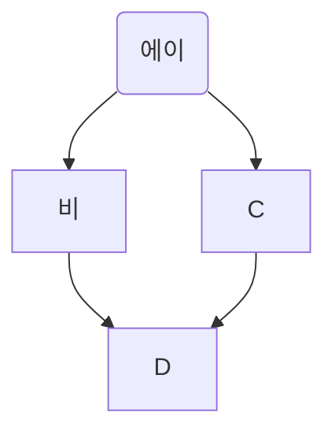
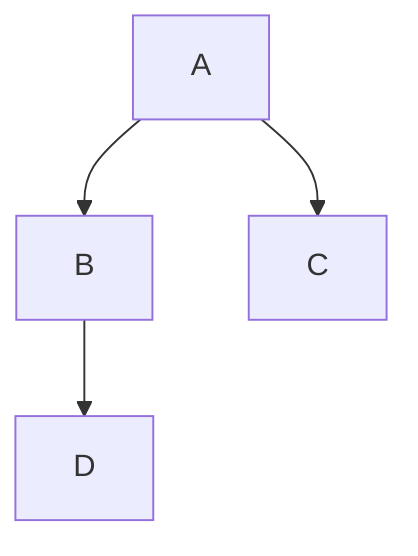
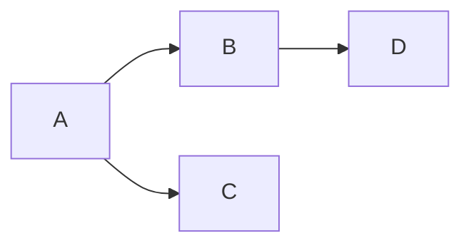
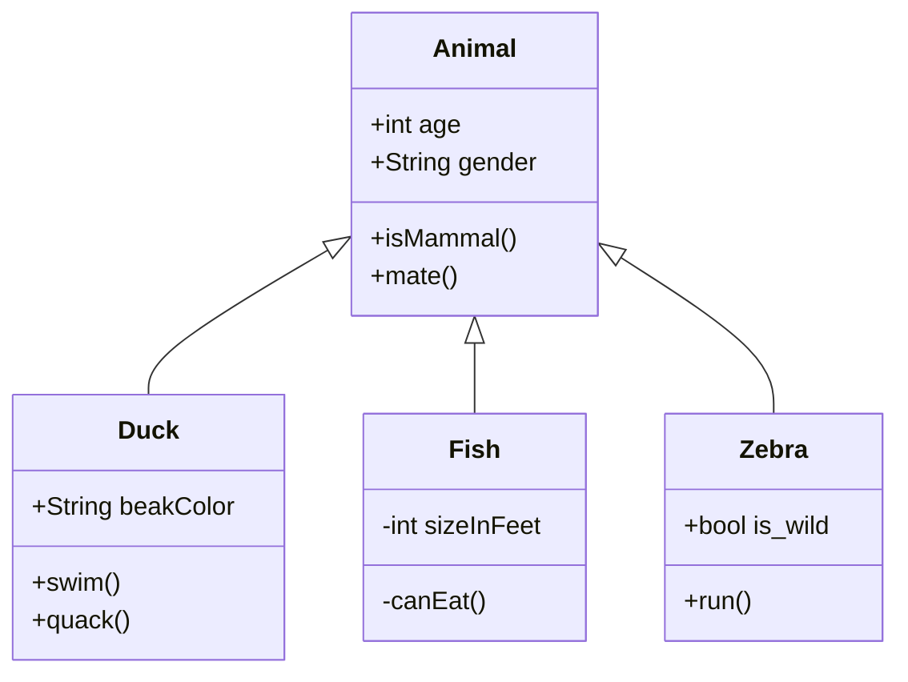

MARKDOWN으로 그래프 그리기
==========================

## mermain flow chart






# Sequence Diagram

```sequence
Alice->Bob: Hello Bob, how are you?
Note right of Bob: Bob thinks
Bob-->Alice: I am good thanks!
```

```sequence
Alice->Bob: Hello Bob, how are you?
Note right of Bob: Bob thinks
Bob-->Alice: I am good thanks!
Bob->Sam: Hello Sam, Nice to see you.
Sam-->Bob: Me too.
Sam-> Alice: Hi, Alice.
Note left of Alice: Alice thinks
Alice-->Sam: I'm good.
```

```sequence
Alice->Bob: Hello Bob, how are you?
Note right of Bob: Bob thinks
Bob-->Alice: I am good thanks!
```

```flow
st=>start: Start
op=>operation: Your Operation
cond=>condition: Yes or No?
e=>end

st->op->cond
cond(yes)->e
cond(no)->op
```





[참고링크](https://richwind.co.kr/147)
