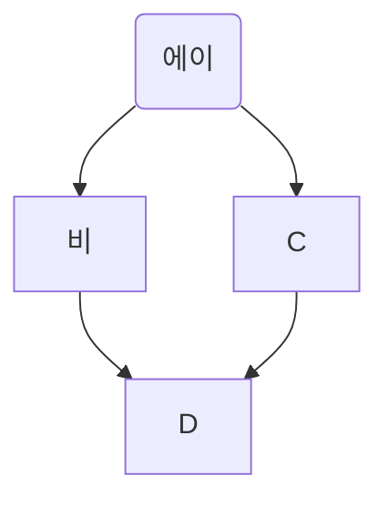
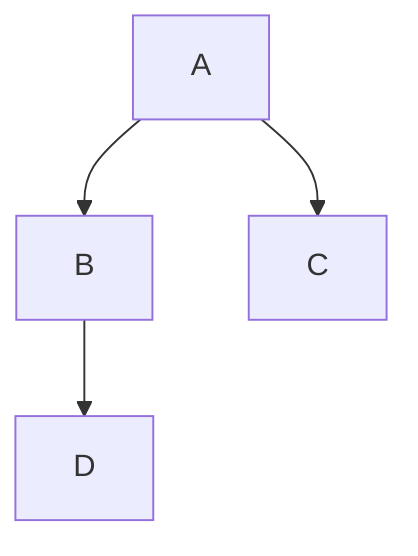
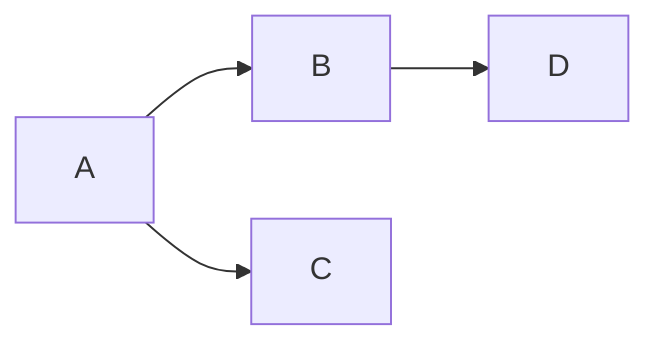
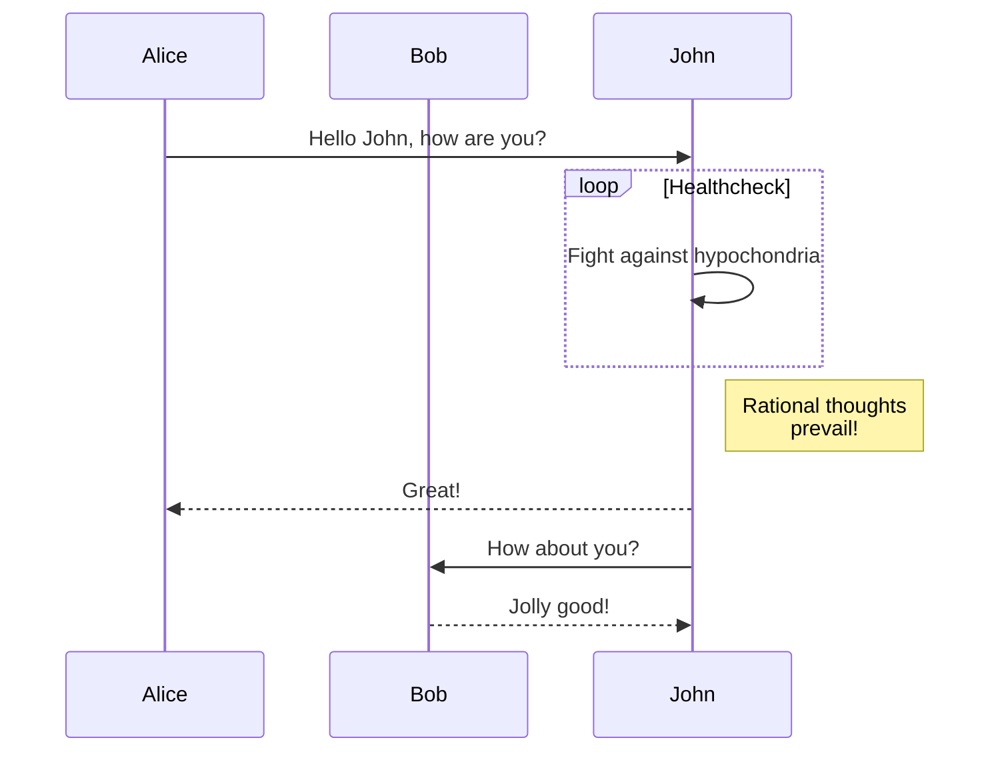
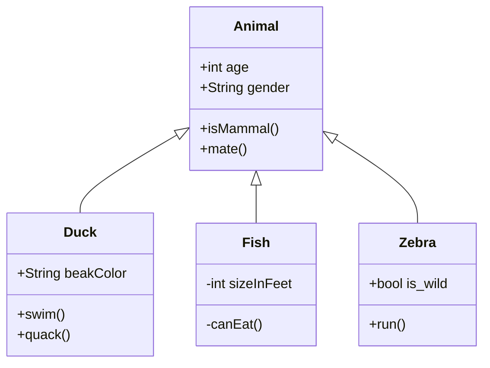
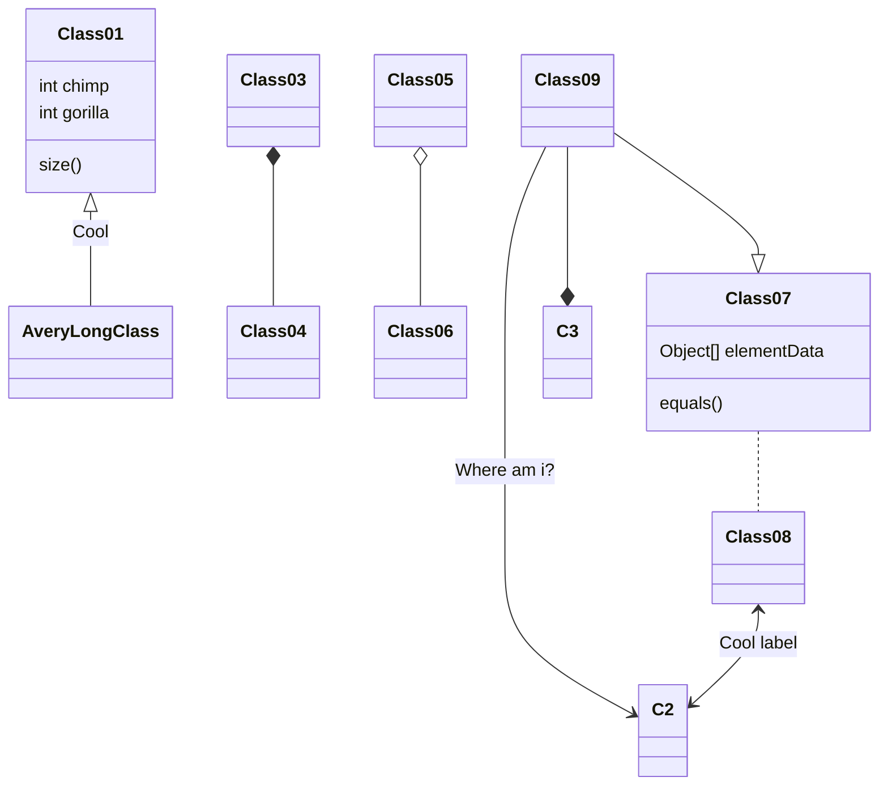

MARKDOWN으로 그래프 그리기
==========================

## mermaid

### Flow chart

---

---

---

### Sequence Diagram

---

---

[참고링크]<https://richwind.co.kr/147>   
[참고링크]<https://mermaid-js.github.io/mermaid/#/>
